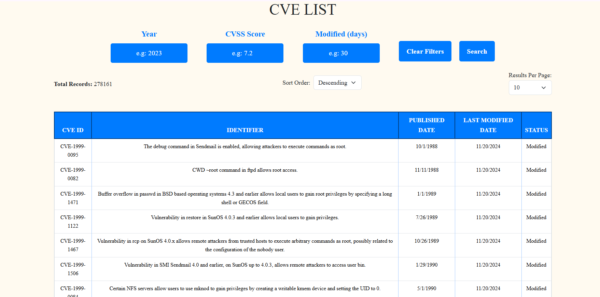

# NVD - CVE API Project

## Overview
This project retrieves and processes CVE data from the National Vulnerability Database (NVD) using their API and stores it in a database. It allows for filtering, sorting, and viewing CVE details through a web interface.

## Features
- **Fetch CVE Data**: Retrieve CVE data from NVD API using `https://services.nvd.nist.gov/rest/json/cves/2.0`.
- **Database Integration**: Store CVE details in a database of choice with periodic synchronization.
- **Data Cleaning & De-duplication**: Ensures the integrity of stored data.
- **API for CVE Filtering**: Filter CVE details by ID, year, score, and modification date.
- **Server-Side Pagination**: Implement pagination for efficient data browsing.
- **Sorting by Date**: Sort results by publication or modification date.

## Setup

1. **Install Dependencies**:
   - Backend: Node.js, Express, Mongoose
   - Frontend: React, Bootstrap

   Run:
   ```bash
   npm install
Configure Database:

Set up a MongoDB database and configure it in .env.
Run Backend:

Start the server:
bash
Copy
Edit
npm start
Server will be running on http://localhost:5000.
Run Frontend:

Start the React app:
bash
Copy
Edit
npm run start
Frontend will be accessible at http://localhost:3000.
API Endpoints
Get List of CVEs:
GET /api/cves

Query params: resultsPerPage, startIndex, year, score, modifiedDays, sortOrder
Filters and pagination for the CVE data.
Get Specific CVE by ID:
GET /api/cves/:cveId

Fetch detailed information for a specific CVE.
Get CVEs by Year:
GET /api/cves/year/:year

Fetch CVEs from a specific year.
Get CVEs by Score:
GET /api/cves/score/:score

Fetch CVEs with a specific score.
Get CVEs Modified in Last X Days:
GET /api/cves/modified/:days

Fetch CVEs modified in the last specified number of days.
UI Implementation
CVE List Page:

Displays CVE records in a table with pagination and sorting.
Filters for Year, Score, and Modified Days.
CVE Detail Page:

Displays detailed information for a specific CVE, including descriptions, metrics, and CPEs.

## Frontend Page


